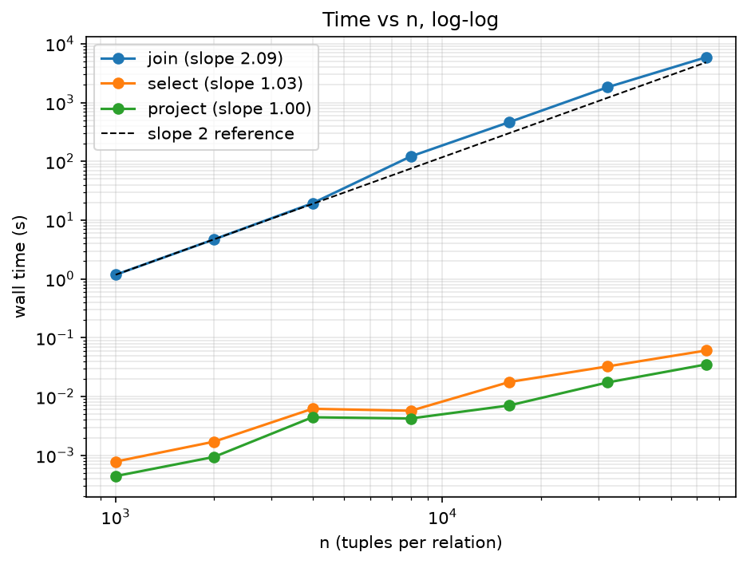

# Performance Report

## Machine, language, version

- Language: Python 3.13 (CPython), standard library only
- OS: Windows, run in the VS Code terminal (PowerShell)
- CPU and RAM: **[add your CPU and RAM here, from Task Manager > Performance]**

## What I ran

- I made the data with `tools/gen_data.py`. It builds two relations, `R(a, b)` and `S(b, c)`, with n tuples each. I used seed 0 and a match rate of 1.0, which means each R tuple matches about one S tuple.
- The query was `R join[R.b=S.b] S`. The engine runs it as a nested loop, exactly as written.
- I added two counters in `ralang/instrument.py`. They are real counts and not estimates.
  - `comparisons` goes up by 1 for every pair of tuples the join loop looks at.
  - `examined` goes up by 1 for every tuple a select looks at.
- The time is measured with `time.perf_counter()` around the query only. Making and loading the data is not included.
- I ran `python tools/bench.py --sizes 1000 2000 4000 8000 16000 32000 64000` once. All seven sizes come from that one run, and the raw numbers are in `results.csv`. The whole run took about 139 minutes.

## Results

Join, `R join[R.b=S.b] S`:

| n | m | comparisons | wall time (s) | output tuples |
|---|---|---|---|---|
| 1000 | 1000 | 1,000,000 | 1.180 | 974 |
| 2000 | 2000 | 4,000,000 | 4.711 | 1,910 |
| 4000 | 4000 | 16,000,000 | 19.387 | 3,971 |
| 8000 | 8000 | 64,000,000 | 121.584 | 8,076 |
| 16000 | 16000 | 256,000,000 | 464.911 | 15,988 |
| 32000 | 32000 | 1,024,000,000 | 1826.824 | 32,132 |
| 64000 | 64000 | 4,096,000,000 | 5890.941 | 63,932 |

Select and project on R alone (`select[a>=0](R)` and `project[a](R)`):

| n | tuples examined by select | select time (s) | project time (s) |
|---|---|---|---|
| 1000 | 1,000 | 0.000783 | 0.000443 |
| 2000 | 2,000 | 0.001707 | 0.000939 |
| 4000 | 4,000 | 0.006189 | 0.004440 |
| 8000 | 8,000 | 0.005731 | 0.004239 |
| 16000 | 16,000 | 0.017652 | 0.007055 |
| 32000 | 32,000 | 0.032565 | 0.017367 |
| 64000 | 64,000 | 0.060635 | 0.035126 |

## Q1. How do n, m and the comparison count relate?

The number of comparisons is n × m, exactly. It matched at all seven sizes with no difference at all. For example, 64000 × 64000 = 4,096,000,000, and that is the number the counter gave.

This makes sense because of how the join is written. It loops over every tuple of R, and for each one it loops over every tuple of S, and the counter goes up once per pass through the inner loop. So the counter is just the number of loop passes. It doesn't matter how many pairs actually match. The number of output tuples does depend on the data (it is about n here because the match rate is 1.0), but that is a different number.

## Q2. Log-log plot and slope

I made this plot with `python tools/plot.py results.csv`. The slope of the join line is **2.09**. I got it by fitting a straight line to log10(time) against log10(n).

If time grows like n to the power k, the line on a log-log plot has slope k. So a slope of about 2 means the time grows with n squared, which is what I expect from a nested loop that compares every pair. When n doubles, the time should go up about four times. Mostly that is what happened: 1000 to 2000 was ×3.99, 2000 to 4000 was ×4.12, 8000 to 16000 was ×3.82, and 16000 to 32000 was ×3.93. The comparison count goes up by exactly ×4 every time n doubles, so the algorithm itself is exactly quadratic. Only the timing is a bit uneven.

The slope is slightly above 2 because the time per comparison was not constant:

| n | microseconds per comparison |
|---|---|
| 1000 | 1.18 |
| 2000 | 1.18 |
| 4000 | 1.21 |
| 8000 | 1.90 |
| 16000 | 1.82 |
| 32000 | 1.78 |
| 64000 | 1.44 |

It stayed near 1.2 up to n = 4000, then jumped to about 1.9 at n = 8000 (that step took ×6.27 the time, not ×4), and then dropped back a bit. I don't know why, and I didn't test any explanation. Some possible reasons are memory and cache effects with bigger data, my laptop slowing down or heating up during a run of more than two hours, or other programs running (my project folder is in OneDrive). What I do know is that timing on my machine is noisy. Before I fixed the memory problem (see Q6), I ran n = 8000 twice with the same join loop and got 153 seconds one time and 363 seconds the other. So the comparison counts are exact, but the times can be off by a lot.

## Q3. How do select and project compare with the join?

The slopes are 1.03 for select, 1.00 for project, and 2.09 for the join. So select and project grow in a straight line with n, and the join grows with n squared.

Select does one pass over R and looks at each tuple once, so the number examined equals n exactly (1,000 up to 64,000 in the table). Project also does one pass: it builds a shorter tuple for each row and removes duplicates using a set. The join is different because it has a loop inside a loop, so each R tuple gets paired with every S tuple.

At n = 64000 the select took 0.061 seconds and the join took 5,891 seconds, so the join was about 97,000 times slower. The gap gets bigger as n grows because the curves have different slopes. For small n the select and project times are tiny (thousandths of a second), so they are hard to measure exactly. For example, select got a little faster from 4000 to 8000 (0.0062 to 0.0057), which is just timer noise.

## Q4. Predicting the join with one million tuples on each side (not run)

Since comparisons = n × m, one million on each side means 1,000,000 × 1,000,000 = 10¹² comparisons. That is 244.1 times more than the n = 64000 run, because (1,000,000 ÷ 64,000)² = 244.14.

**Method 1: use the speed from my biggest run.** At n = 64000 the join did 4,096,000,000 comparisons in 5,890.94 seconds. That is 4,096,000,000 ÷ 5,890.94 = 695,305 comparisons per second. So 10¹² ÷ 695,305 = about 1,438,000 seconds, which is about 400 hours or **16.6 days**. (Multiplying 5,890.94 by 244.14 gives the same answer.)

**Method 2: use the fitted line.** The fit gave slope 2.094 and intercept −6.200. So time = 10^(2.094 × 6 − 6.200) = 10^6.364, which is about 2,319,000 seconds, or about 644 hours, or **26.8 days**.

The two answers differ by about 1.6 times, but both say the join would take weeks. I would say **roughly 17 to 27 days**. Method 1 assumes the time per comparison at one million is the same as at 64000 (1.44 microseconds). Q2 showed that number moved around a lot in my own results, so I can't be sure of it. Method 2 uses all seven points, including the slower ones in the middle, so it comes out higher. I did not run the one million join, since the assignment says not to.

## Q5. Does the match rate change the comparisons or the time?

I ran the same size (n = m = 4000) twice with the same seed, once at match rate 1.0 and once at 10.0. I made the second run with `python tools/bench.py --sizes 4000 --match-rate 10.0 --out results_mr10.csv`.

| match rate | comparisons | wall time (s) | output tuples |
|---|---|---|---|
| 1.0 | 16,000,000 | 19.387 | 3,971 |
| 10.0 | 16,000,000 | 18.850 | 39,977 |

**Comparisons did not change.** Both runs did exactly 16,000,000 (4000 × 4000). The join checks every pair no matter what the data looks like, so the count only depends on n and m.

**The output size grew about ten times** (39,977 compared to 3,971). This is what I expected: with a match rate of 10, each R tuple matches about 10 S tuples, so the output should be about 4000 × 10 = 40,000.

**The time did not change in any way I could measure.** It was 18.850 seconds compared to 19.387 seconds, which is 2.8% less, even though there were more matches. I only ran each setting once, and Q2 showed that the same run can vary by much more than 3% on my machine. So I treat this as "no difference I can detect" and I don't claim that more matches is faster.

**Why the two answers are different.** The comparison count only counts passes through the inner loop. The wall time counts everything the program does. Every pair costs about the same whether it matches or not, since the program builds the combined tuple and tests the condition either way. A matching pair adds one extra step, which is adding the tuple to the output list. Going from rate 1.0 to 10.0 adds about 36,000 of those (39,977 minus 3,971) on top of 16,000,000 passes through the loop. That is only about 0.2% more work, which is much smaller than the noise. If the match rate were so high that the output got close to n × m tuples, the output would start to matter for both time and memory. I did not test that case.

## Q6. What would make the one million join possible?

My first version of the join built the whole cross product in memory and only then filtered it. That worked for small sizes, but at n = m = 32000 it ran out of memory (a `MemoryError`), because the cross product has over a billion rows. I fixed it by checking the join condition inside the same loop, so a pair that doesn't match is never stored. The number of comparisons stayed the same (n × m), but the memory used dropped from the size of the cross product to the size of the output.

That fix lets the join finish, but it doesn't make it fast. The real problem is that every R tuple is compared with every S tuple, which is 10¹² comparisons at one million tuples, because nothing lets the join skip pairs that can't match. To make it possible, the engine would need a way to find the matching S tuples for one R tuple without scanning all of S. An index on the join column, a hash join (build a hash table from one relation and look up each tuple of the other), or a sort-merge join would all do that. They would bring the work down from about n × m to about n + m plus the size of the output, which is roughly two million steps here instead of 10¹². The assignment says these are out of scope for this project (Section 3) and leaves them for the later projects on indexes and the cost model.
